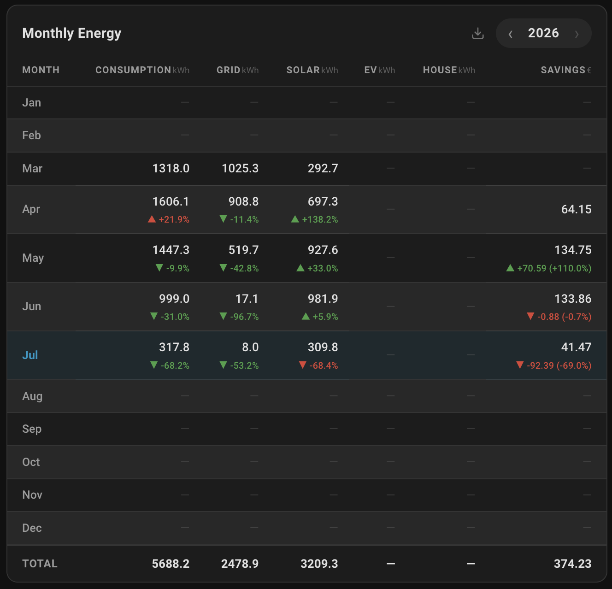

# Statistics Table Card

A custom Lovelace card for Home Assistant that displays long-term statistics grouped by month in a table, with year navigation.

[](https://github.com/hacs/integration)



## Features

- One row per month, one column per entity
- Derived columns with safe formulas
- Totals row at the bottom
- Previous / next year navigation
- Month-over-month and year-over-year change indicators per entity
- Horizontal scroll with sticky month column when many entities are configured
- Export data as TSV (copy to clipboard) or CSV download
- Reads from HA long-term statistics — survives recorder purges
- Works with any sensor that has `state_class: total` or `total_increasing`

## Installation

### HACS (recommended)

1. Open HACS → Frontend → ⋮ → Custom repositories
2. Add `https://github.com/Zarvinx/statistics-table-card` as category **Lovelace**
3. Install **Statistics Table Card**
4. Reload the configuration

### Manual

1. Copy `statistics-table-card.js` to `/config/www/`
2. Add to `configuration.yaml`:
   ```yaml
   frontend:
     extra_module_url:
       - /local/statistics-table-card.js
   ```
3. Reload Home Assistant

## Configuration

```yaml
type: custom:statistics-table-card
title: Monthly Energy          # optional, default: "Monthly Statistics"
year: 2026                     # optional, pins to a specific year; omit to default to current year
hide_empty: true
grid_options:
  columns: 18
  rows: auto
entities:
  - entity: sensor.inverter_monthly_energy_import
    id: import_energy
    name: Import
    unit: kWh
    decimals: 1
    mom: percent
    invert_delta: true
  - entity: sensor.inverter_monthly_production
    id: solar_energy
    name: Solar
    unit: kWh
    decimals: 1
    mom: percent
  - entity: sensor.battery_to_load_monthly
    id: battery_to_load
    name: Bat→Load
    unit: kWh
    decimals: 1
    mom: percent
  - entity: sensor.total_savings
    id: total_savings
    name: Savings
    unit: "€"
    decimals: 2
    mom: both
  - type: derived
    id: net_grid_cost
    name: Net Grid Cost
    formula: total_savings / import_energy
    unit: "€/kWh"
    decimals: 3
    mom: raw
  - type: derived
    id: self_powered_share
    name: Self Powered
    formula: (solar_energy + battery_to_load) / (solar_energy + battery_to_load + import_energy)
    unit: "%"
    decimals: 3
    yoy: percent
  - type: derived
    name: Savings per kWh
    formula: abs(total_savings / import_energy)
    unit: "€/kWh"
    decimals: 3
```

### Card options

| Option | Type | Default | Description |
|--------|------|---------|-------------|
| `title` | string | `Monthly Statistics` | Card title |
| `year` | number | current year | Initial year; omit to default to current year |
| `hide_empty` | boolean | `false` | Hide months where all entity values are absent |
| `entities` | list | **required** | Columns to display |

### Entity options

| Option | Type | Default | Description |
|--------|------|---------|-------------|
| `entity` | string | **required** | Entity ID |
| `id` | string | entity ID | Stable column ID. Helpful when another derived column needs to reference this column in a formula. Use letters, numbers, `_`, `.`, `:`, or `-`, and start with a letter or `_`. |
| `name` | string | entity ID | Column header label |
| `unit` | string | `''` | Unit shown in header |
| `decimals` | number | `1` | Decimal places |
| `yoy` | `false` \| `true` \| `'percent'` \| `'raw'` \| `'both'` | `false` | Year-over-year change vs the same month last year. `true` is an alias for `'percent'`. |
| `mom` | `false` \| `true` \| `'percent'` \| `'raw'` \| `'both'` | `false` | Month-over-month change vs the previous month. `true` is an alias for `'percent'`. |
| `invert_delta` | boolean | `false` | Invert change colors — decreases become green, increases red. Useful for consumption sensors where less is better. |

### Derived column options

Use `type: derived` to define a calculated column from other columns.

| Option | Type | Default | Description |
|--------|------|---------|-------------|
| `type` | string | **required** | Must be `derived` |
| `id` | string | generated | Stable column ID for other derived columns. Use letters, numbers, `_`, `.`, `:`, or `-`, and start with a letter or `_` if you want to reference it in a formula. |
| `name` | string | generated | Column header label |
| `formula` | string | **required** | Safe math expression using column IDs or entity IDs |
| `unit` | string | `''` | Unit shown in header |
| `decimals` | number | `1` | Decimal places |
| `yoy` | `false` \| `true` \| `'percent'` \| `'raw'` \| `'both'` | `false` | Year-over-year change for the derived values |
| `mom` | `false` \| `true` \| `'percent'` \| `'raw'` \| `'both'` | `false` | Month-over-month change for the derived values |
| `invert_delta` | boolean | `false` | Invert change colors |

Derived columns can appear anywhere in the list. Circular references are rejected.

Supported formula syntax:

```text
+  -  *  /
(...)
column_id / entity_id references
unary + and unary -
abs(x)
min(a, b, ...)
max(a, b, ...)
```

#### Change display modes (applies to both `yoy` and `mom`)

| Value | Shows |
|-------|-------|
| `percent` / `true` | `▲ +15.2%` |
| `raw` | `▲ +132.1` (uses `decimals`) |
| `both` | `▲ +132.1 (+15.2%)` |

Both `yoy` and `mom` can be set on the same entity and will stack as separate sub-lines.

## Notes

- Uses `recorder/statistics_during_period` with `period: month` and `type: change` (delta per month)
- Months with no recorded data show `—`
- Division returns `—` when the denominator is missing or zero
- Formula-based totals are calculated from the totals of the referenced columns, not by summing the monthly formula results
- Derived columns can reference any column by `id` or by base `entity` ID
- Circular references between derived columns are rejected
- Future years are not navigable
- Copy to clipboard uses `execCommand` fallback on non-HTTPS origins
